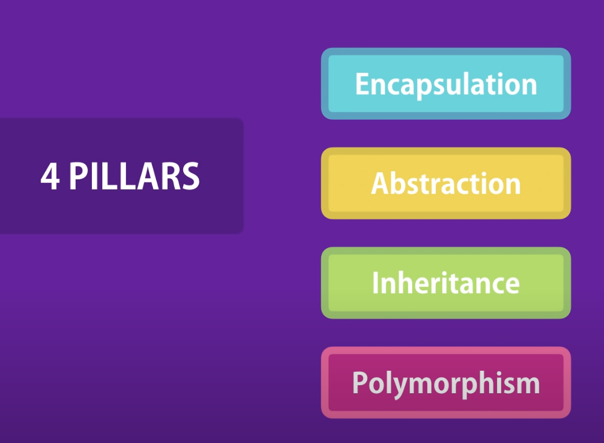
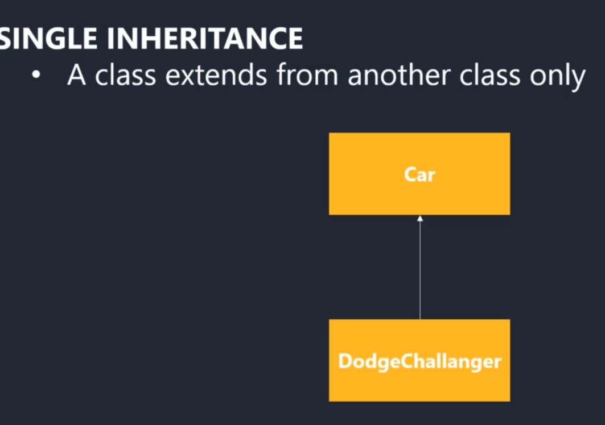
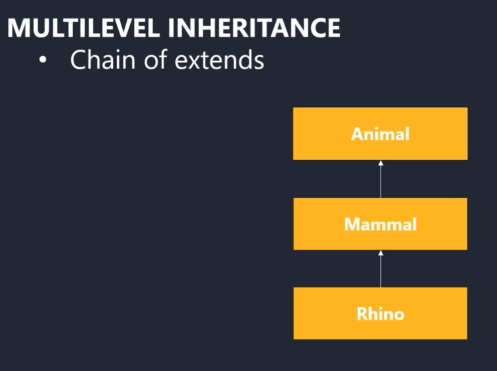
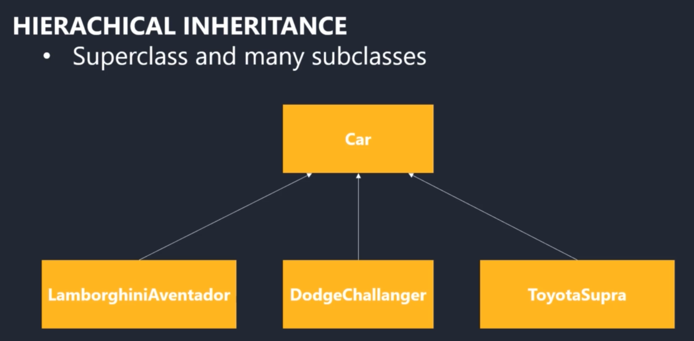
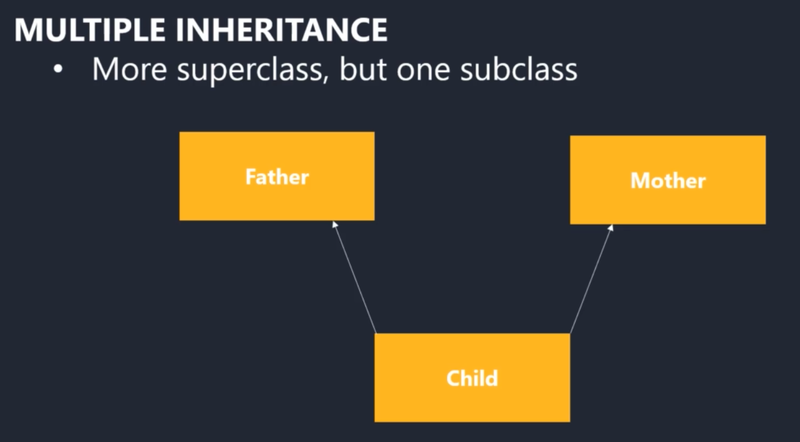
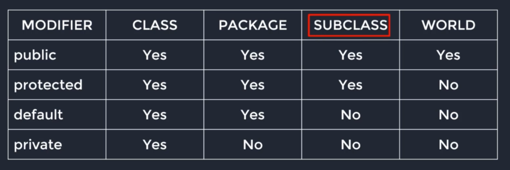

# Object Oriented Programming
- Procedural programming divides program into set of functions (data stored on variables, function operates on those data)
- In procedural programming, change in one function breaks many others (inter dependency between codes)
- OOP solves these issues
- OOP combines group of related function, variables in a unit, these variables are property, functions are called methods 
 
## Four principles of OOP: 
## Four coure concepts of OOP:


1. Inheritance: relationship of classes, a class can have variables, functions of another class
2. Encapsulation: Hiding data from other classes via access modifier
3. Abstraction: Hiding details from outside the class
4. Polymorphism: Having a Java element which can be used in many forms. Example: functions with the same function name but different parameters

## Inheritance
- Allows to define a new class from an existing one and inherit it's attributes and methods
- Eliminate redundant code
- **Is A Relationship:** subclass is a superclass









- Multiple Inheritance isn't allowed with classes in java but with interface it's allowed
- Two superclass with same method, child class inheriting from both of them: this will cause issue that's why not allowed this way
- With interface this is allowed as interface doesn't have function body

## Encapsulation
- **We group related variables & functions that operate on them in class** 
- Wrapping up of data under a single unit & prevents data from being accessed by the code outside
- Using classes to encapsulate data & access modifier to hide them
- Only getter - readonly, Only setter - writeonly

## Abstraction 
- Hide some properties, methods 
- Gives simpler interface, only the essential details are displayed to the user. Hiding certain details of the implementation.
- Reduce impact of change: we change some private methods, those won't let the outer interface change
### Abstract class
- Can have abstract and regular methods 
- Can't be used to create objects 
- Must be extended by other classes to use them 
- Abstract method can only exist in an abstract class, it doesn't have body as the body will be provided by the subclass
### Interface 
- can have methods, variables 
- methods are allowed only without body, body is provided by the class that implements it 
- can't be used to create objects 
- all fields, methods are public abstract final

## Polymorphism (Many Form)


# Class 
- Blueprints of prototypes to create objects
# Objects 
- Actual instance of classes

## Access Modifier
- Are used to set the accessibility of classes, methods, class variables & other java elements
- Access Modifier can't be used for local variables (inside function, loops)
- Guideline: Restrict access as much as you can
```
Default: Only within the package
Private: Within the class Only
Protected: Within the package and all subclasses
Public: Visible everywhere
```


