# Object
- Instance of class
- Has state & behaviour
- null is internal default state for class (uninitialized class variable set to null by default )


# Constructor
## this & super
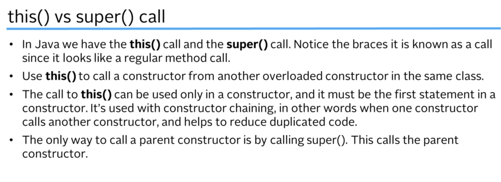 <br />
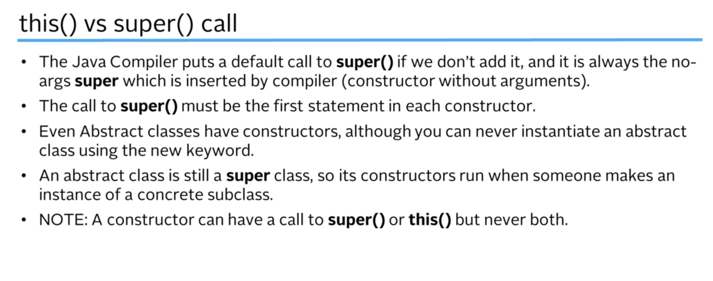 <br />
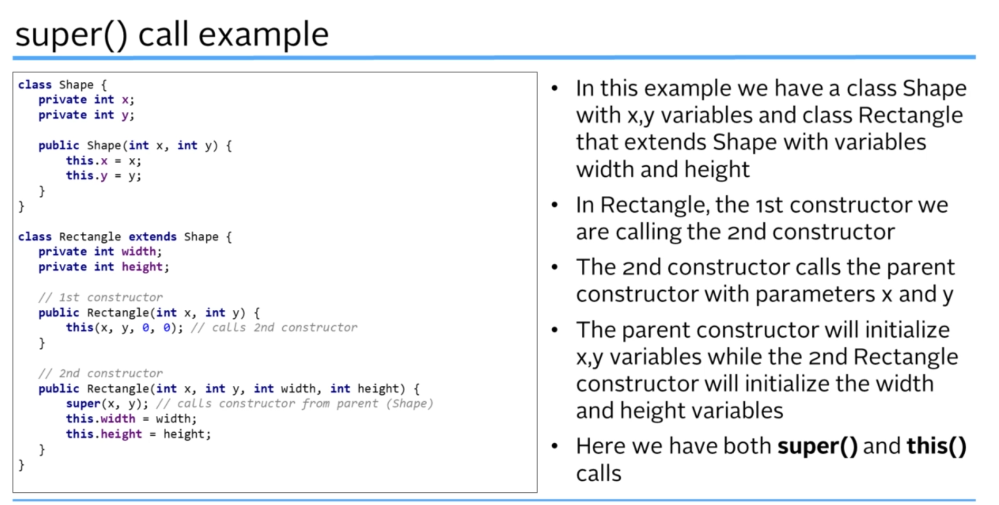 <br />

## Overloading constructor
```
public BankAccount() {
    this("123", "Utshaw", "utshaw@example.com", "01800000000", 123);
}

public BankAccount(String accountNumber, String customerName, String email, String phoneNumber, long balance) {
    this.accountNumber = accountNumber;
    this.customerName = customerName;
    this.email = email;
    this.phoneNumber = phoneNumber;
    this.balance = balance;
}
```
## Method overloading
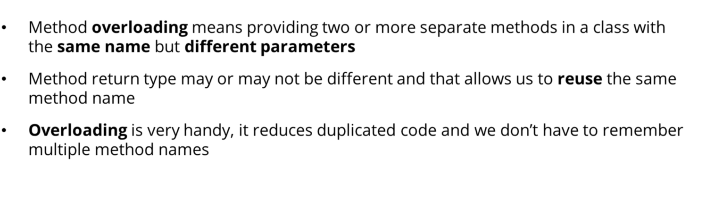 <br />
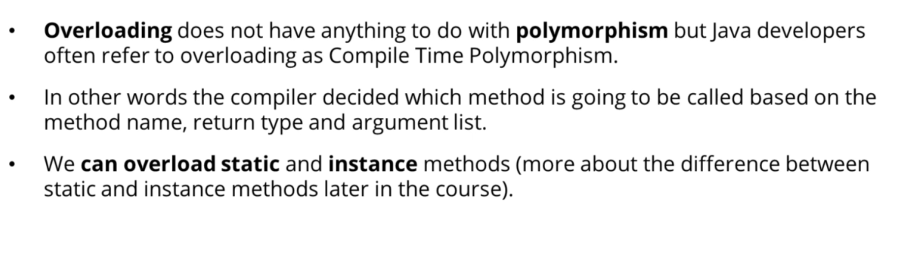 <br />
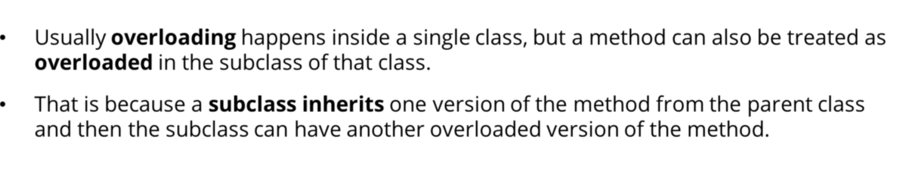 <br />
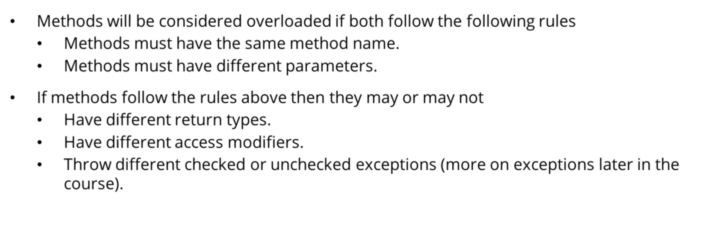 <br />


## Method overriding
- Methods can only  be overridden in child classes
- final methods can't be overridden
- super.methodName() to call the super class version of an overridden method

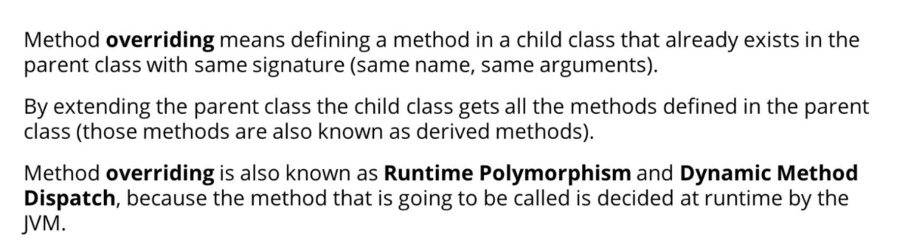 <br />
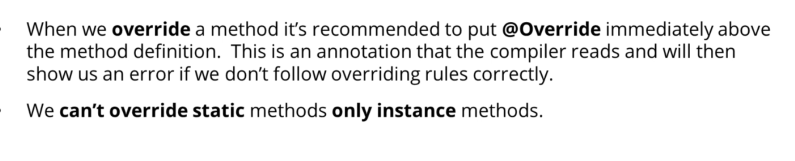 <br />
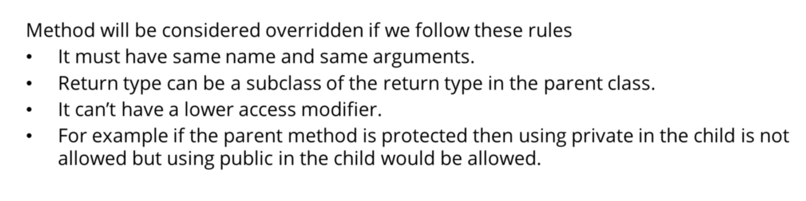 <br />
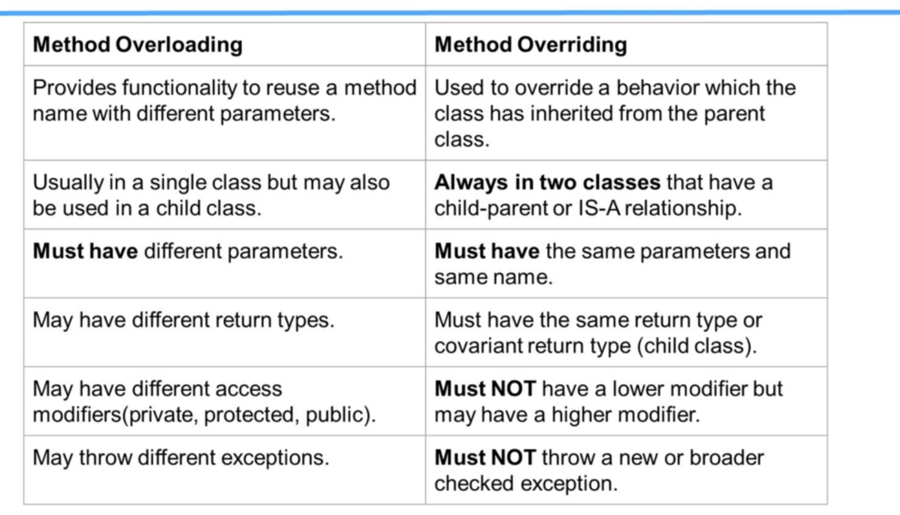 <br />

## Overriding constructor/method

- Animal.java
```
public class Animal {
    private String name;
    public Animal(String name) {
        this.name = name;
    }
    public void eat() {
        System.out.println("Animal eating");
    }
}
```
- Cat.java
```
public class Cat extends Animal {
    public Cat(String name) {
        super(name);
    }
    @Override
    public void eat() {
        super.eat();
        System.out.println("To be specific, cat is eating");
    }
}
```